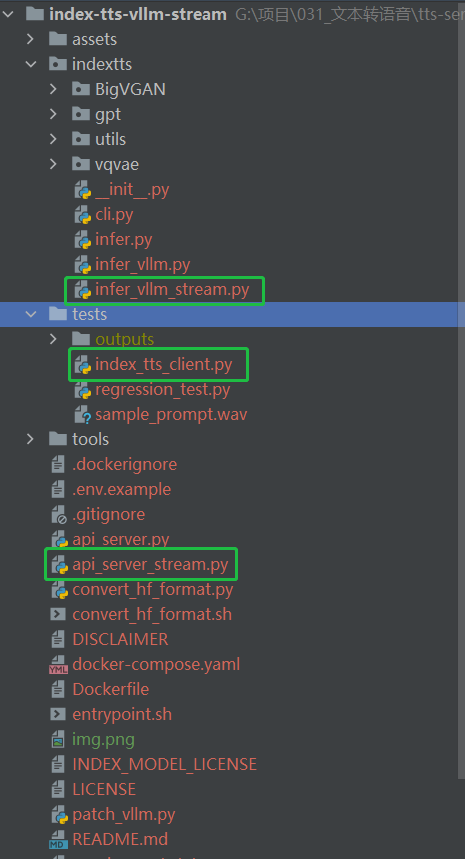
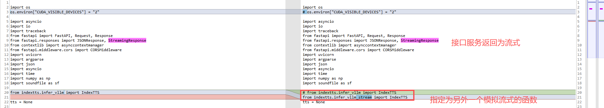
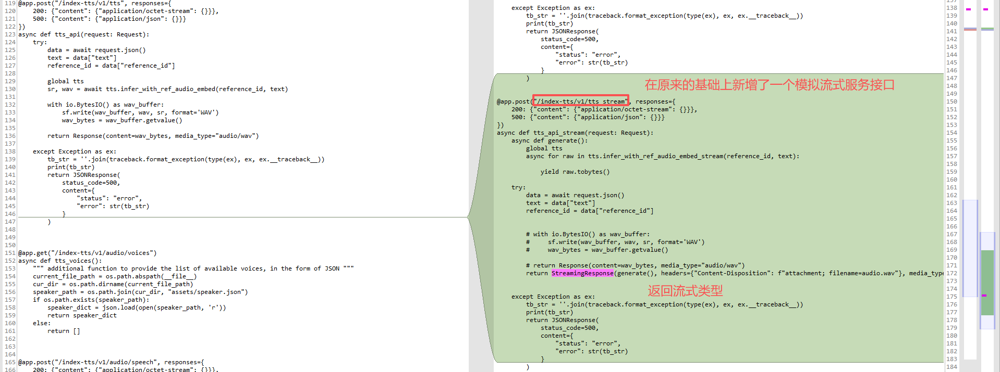
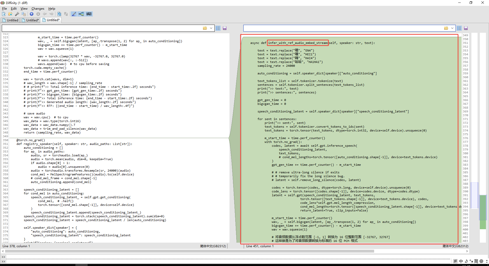

<div align="center">

# IndexTTS-vLLM
</div>

## 项目简介
该项目在 [index-tts](https://github.com/index-tts/index-tts) 的基础上使用 vllm 库重新实现了 gpt 模型的推理，加速了 index-tts 的推理过程。

推理速度在单卡 RTX 4090 上的提升为：
- 单个请求的 RTF (Real-Time Factor)：≈0.3 -> ≈0.1
- 单个请求的 gpt 模型 decode 速度：≈90 token / s -> ≈280 token / s
- 并发量：gpu_memory_utilization设置为0.5（约12GB显存）的情况下，vllm 显示 `Maximum concurrency for 608 tokens per request: 237.18x`，两百多并发，man！当然考虑 TTFT 以及其他推理成本（bigvgan 等），实测 16 左右的并发无压力（测速脚本参考 `simple_test.py`）

## 新特性
- 支持多角色音频混合：可以传入多个参考音频，TTS 输出的角色声线为多个参考音频的混合版本（输入多个参考音频会导致输出的角色声线不稳定，可以抽卡抽到满意的声线再作为参考音频）

## 性能
Word Error Rate (WER) Results for IndexTTS and Baseline Models on the [**seed-test**](https://github.com/BytedanceSpeech/seed-tts-eval)

| model                   | zh    | en    |
| ----------------------- | ----- | ----- |
| Human                   | 1.254 | 2.143 |
| index-tts (num_beams=3) | 1.005 | 1.943 |
| index-tts (num_beams=1) | 1.107 | 2.032 |
| index-tts-vllm      | 1.12  | 1.987 |

基本保持了原项目的性能

## 更新日志

- **[2025-08-07]** 支持 Docker 全自动化一键部署 API 服务：`docker compose up`

- **[2025-08-06]** 支持 openai 接口格式调用：
    1. 添加 /audio/speech api 路径，兼容 OpenAI 接口
    2. 添加 /audio/voices api 路径， 获得 voice/character 列表
    - 对应：[createSpeech](https://platform.openai.com/docs/api-reference/audio/createSpeech)

## 使用步骤

### 1. git 本项目
```bash
git clone https://github.com/Ksuriuri/index-tts-vllm.git
cd index-tts-vllm
```


### 2. 创建并激活 conda 环境
```bash
conda create -n index-tts-vllm python=3.12
conda activate index-tts-vllm
```


### 3. 安装 pytorch

优先建议安装 pytorch 2.7.0（对应 vllm 0.9.0），具体安装指令请参考：[pytorch 官网](https://pytorch.org/get-started/locally/)

若显卡不支持，请安装 pytorch 2.5.1（对应 vllm 0.7.3），并将 [requirements.txt](requirements.txt) 中 `vllm==0.9.0` 修改为 `vllm==0.7.3`


### 4. 安装依赖
```bash
pip install -r requirements.txt
```


### 5. 下载模型权重

此为官方权重文件，下载到本地任意路径即可，支持 IndexTTS-1.5 的权重

| **HuggingFace**                                          | **ModelScope** |
|----------------------------------------------------------|----------------------------------------------------------|
| [IndexTTS](https://huggingface.co/IndexTeam/Index-TTS) | [IndexTTS](https://modelscope.cn/models/IndexTeam/Index-TTS) |
| [😁IndexTTS-1.5](https://huggingface.co/IndexTeam/IndexTTS-1.5) | [IndexTTS-1.5](https://modelscope.cn/models/IndexTeam/IndexTTS-1.5) |

### 6. 模型权重转换

```bash
bash convert_hf_format.sh /path/to/your/model_dir
```

此操作会将官方的模型权重转换为 transformers 库兼容的版本，保存在模型权重路径下的 `vllm` 文件夹中，方便后续 vllm 库加载模型权重

### 7. webui 启动！
将 [`webui.py`](webui.py) 中的 `model_dir` 修改为模型权重下载路径，然后运行：

```bash
VLLM_USE_V1=0 python webui.py
```
第一次启动可能会久一些，因为要对 bigvgan 进行 cuda 核编译

注：一定要带上 `VLLM_USE_V1=0` ，因为本项目没有对 vllm 的 v1 版本做兼容


## API

使用 fastapi 封装了 api 接口，启动示例如下：

```bash
VLLM_USE_V1=0 python api_server.py --model_dir /your/path/to/Index-TTS --port 11996
```

注：一定要带上 `VLLM_USE_V1=0` ，因为本项目没有对 vllm 的 v1 版本做兼容

### 启动参数
- `--model_dir`: 模型权重下载路径
- `--host`: 服务ip地址
- `--port`: 服务端口
- `--gpu_memory_utilization`: vllm 显存占用率，默认设置为 `0.25`

### 请求示例
```python
import requests

url = "http://0.0.0.0:11996/tts_url"
data = {
    "text": "还是会想你，还是想登你",
    "audio_paths": [  # 支持多参考音频
        "audio1.wav",
        "audio2.wav"
    ]
}

response = requests.post(url, json=data)
with open("output.wav", "wb") as f:
    f.write(response.content)
```

### OpenAI API
- 添加 /audio/speech api 路径，兼容 OpenAI 接口
- 添加 /audio/voices api 路径， 获得 voice/character 列表

详见：[createSpeech](https://platform.openai.com/docs/api-reference/audio/createSpeech)

## 并发测试
参考 [`simple_test.py`](simple_test.py)，需先启动 API 服务


# 以下为改动说明
## 模拟流式的方案
在index-tts-vllm的基础上有新增了模拟流式接口及客户端测试脚本，由于模型本身不支持流式返回，但可以根据切分的小段文本逐个推理并迭代返回。
- infer_with_ref_audio_embed是逐个推理拼接后才一次性返回（return方法）
- infer_with_ref_audio_embed_stream是逐个推理并迭代返回（yield）

## 主要改动
主要改动有以下3处代码，其中

- 服务脚本为api_server_stream.py
- 关键改动为/index-tts-vllm-stream/indextts
- 客户端脚本为index_tts_client.py

api_server_stream.py在api_server.py的基础上新增了/index-tts/v1/tts_stream模拟流式接口。



infer_vllm_stream.py在infer_vllm.py的基础上新增了infer_with_ref_audio_embed_stream函数，将return一次性返回改为yield迭代返回。

  
index_tts_client.py则分别验证了流式及非流式调用：

- 其中流式还提供了实时流式播报及音频文件保存，但如果postman直接请求，所保存文件并不是标准的音频文件。
  
- 非流式调用test_tts_non_streaming是可以通过postman来发送请求并存储为标准的音频文件的。

```bash
## 启动服务端
cd /index-tts-vllm-stream
VLLM_USE_V1=0 python api_server_stream.py --model_dir ./weights/IndexTTS-1.5 --port 11996


## 执行客户端
cd /index-tts-vllm-stream/tests
python index_tts_client.py
```


## 新增音色配置
在该目录下添加所需克隆的音频文件，并编辑./assets/speaker.json。在调用接口时传入即可
{
  "text": "在新车预告一个月后，特斯拉大六座MODEL Y L正式上市。",
  "reference_id": "broadcast",
}